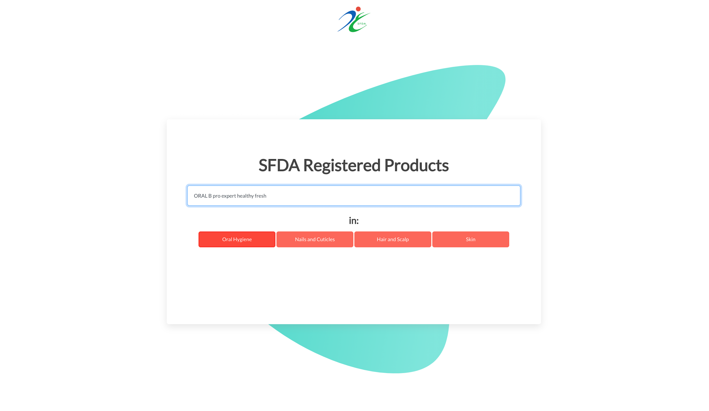

# Is My Product Registered?

> Search for Registered Personal-Care Products

## About

More and more companies are producing numerous self-care products. These types of products are manufactured using various ingredients with different levels of safety.
One of the goals of the Saudi Food and Drug Authority (SFDA) is to make sure that products can be safely used by the public. If a product was safe, it would be registered by the SFDA.

The purpose of this project is to provide a search engine for Saudi Food and Drug Authority (SFDA) registered products. It enables users to determine whether a certain product was registered by the SFDA or not.

## Usage example



This project is a search engine for SFDA registered products. In the text field, a user is able to enter the name of a certain product belonging to one of four different categories (I.e. oral hygiene, nails and cuticles, hair and scalp, and skin).

## This project uses

- JQuery

```sh
  <script src="https://ajax.googleapis.com/ajax/libs/jquery/1.12.4/jquery.min.js"></script>
```

- Froala Design Blocks

```sh
    <link
      type="text/css"
      rel="stylesheet"
      href="https://cdnjs.cloudflare.com/ajax/libs/froala-design-blocks/2.0.0/css/froala_blocks.min.css"
    />
```

- Bootstrap , Font-awesome , and Google-fonts

## Resources

- [Saudi Open Data Portal ](https://www.data.gov.sa/Data/en/dataset?q=sfda)

## Disclaimer

THIS IS NOT AN SFDA PRODUCT. THE LOGO WAS USED FOR DEMONSTRATION PURPOSES ONLY.
